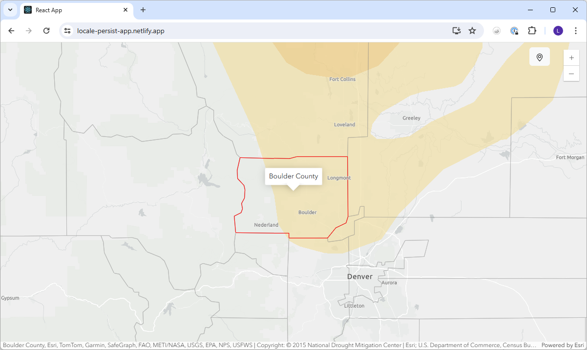

# Locale Persist App

## About this app

This application was created to be used as an embed within an ArcGIS StoryMaps story.  The application allows the StoryMap user to drill down to a specific county.  The chosen county then persists across the various elements of the story.  

You can see an example of the app in use <a target="_blank" href="https://storymaps.arcgis.com/stories/dc7fce3e22e84637bbaa36860d7fcf5e">here</a>.

## Developer notes

This project was bootstrapped with [Create React App](https://github.com/facebook/create-react-app).

In the project directory, you can run:

### `npm start`

Runs the app in the development mode.\
Open [http://localhost:3000](http://localhost:3000) to view it in your browser.

The page will reload when you make changes.\
You may also see any lint errors in the console.

### `npm run build`

Builds the app for production to the `build` folder.\
It correctly bundles React in production mode and optimizes the build for the best performance.

The build is minified and the filenames include the hashes.\
Your app is ready to be deployed!

See the section about [deployment](https://facebook.github.io/create-react-app/docs/deployment) for more information.

### Deployment

This section has moved here: [https://facebook.github.io/create-react-app/docs/deployment](https://facebook.github.io/create-react-app/docs/deployment)
